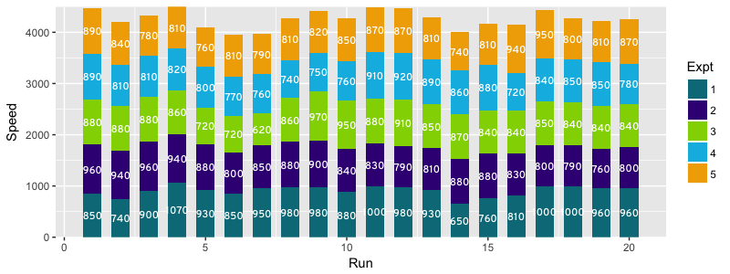
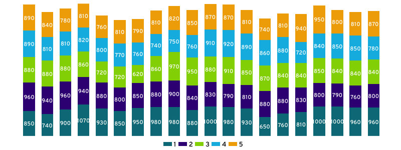
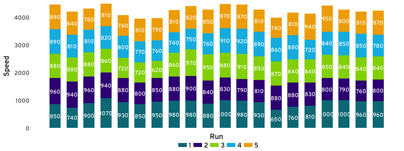
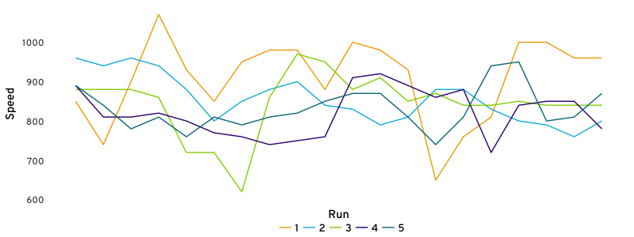
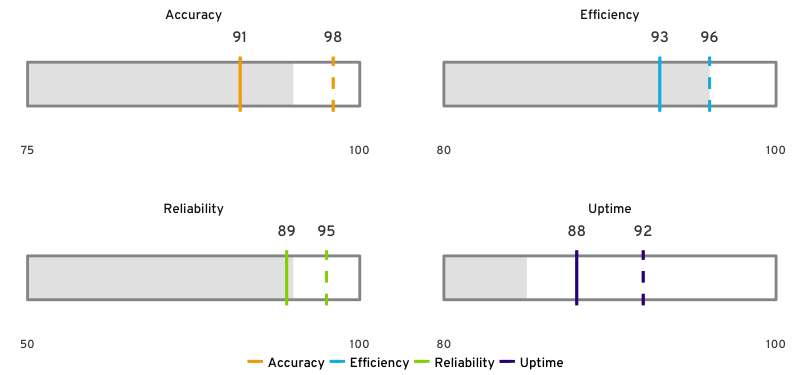
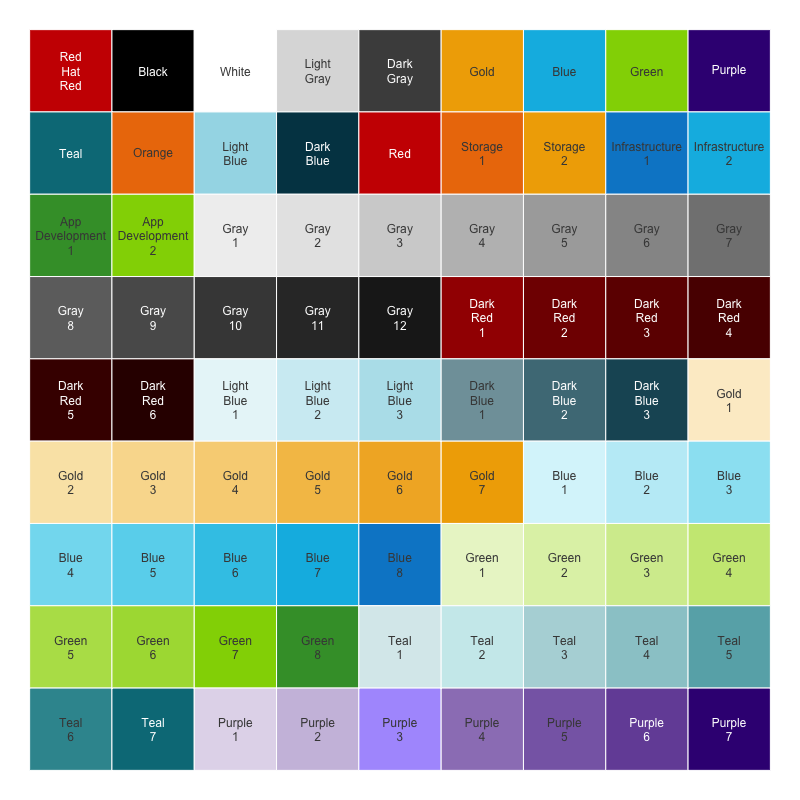

# ggquik
### Quick Plotting ggplot2 Wrapper

Using ggplot2, create quick bar, line, and bullet plots using standardized layouts and Red Hat color schemes.

In order to install ggquik:

``` R
# Install the development version from GitHub:
# install.packages("devtools")
devtools::install_github("brascoball/ggquik") 
```

## Contents

This package has three main functions: `quik_bars()`, `quik_lines()`, `quik_bullets()`, `show_redhat_colors()`:

### quik_bars()
This function uses ggplot2 to quickly create a bar plot using ggquik plot standards. The function only requires a dataset, `dimension`, `measure`, and `bar_groups`:

``` R
data(morley)
ggq <- quik_bars(morley, dimension = 'Run', measure = 'Speed', bar_groups = 'Expt')
ggq
```



ggquik also has a very simple theme that is very customizable:

``` R
quik_theme(ggq)
```



And, if you want to keep the axis tick labels (`axis.text`) titles (`axis.title`):

``` R
quik_theme(ggq, axis.text = c('y'), axis.title = c('x', 'y'))
```



### quik_lines()
This function uses ggplot2 to quickly create a line plot using ggquik plot standards. The function only requires a dataset, `dimension`, `measure`, and `line_groups`. Using the same example, since there are a LOT of labels, we'll set the `label_size` to 0, and also use the same theme parameters as 

``` R
data(morley)
ggq <- quik_lines(morley, dimension = 'Run', measure = 'Speed', line_groups = 'Expt', label_size = 0)
quik_theme(ggq, axis.text = 'y', axis.title = c('x', 'y'))
```




### quik_bullets()
This is a more manual plot, but is helpful for things like key performance indicators (KPIs). It requires a dataset, `group`, `range_low`, `range_high`, and measure (`bar_fill`, `dotted_line`, or `solid_line`). For example you could just use a solid line:

``` R
df <- data.frame(
  group = factor(c('Reliability', 'Accuracy', 'Uptime', 'Efficiency')),
  dotted = sample(90:100, 4), solid = sample(80:100, 4),
  fill = sample(80:100, 4), low = c(50, 75, 80, 80), high = rep(100, 4)
)
ggq <- quik_bullets(df, group_col = 'group', range_low = 'low', range_high = 'high',
                    solid_line = 'solid')
quik_theme(ggq, axis.text = 'x')
```

Or, you could use all three:

``` R
ggq <- quik_bullets(df, group_col = 'group', range_low = 'low', range_high = 'high',
                    solid_line = 'solid', dotted_line = 'dotted', bar_fill = 'fill')
quik_theme(ggq, axis.text = 'x')
```



### show_redhat_colors()
The standard colors in ggquik are the [open source colors](brand.redhat.com/elements/color/) used at Red Hat. `show_redhat_colors()` allows you to see all the color options that can be used for the `quik_bars(bar_colors)`, `quik_lines(line_colors)`, and `quik_bullets(line_colors)` parameters. The colors are displayed in a plot like this:


