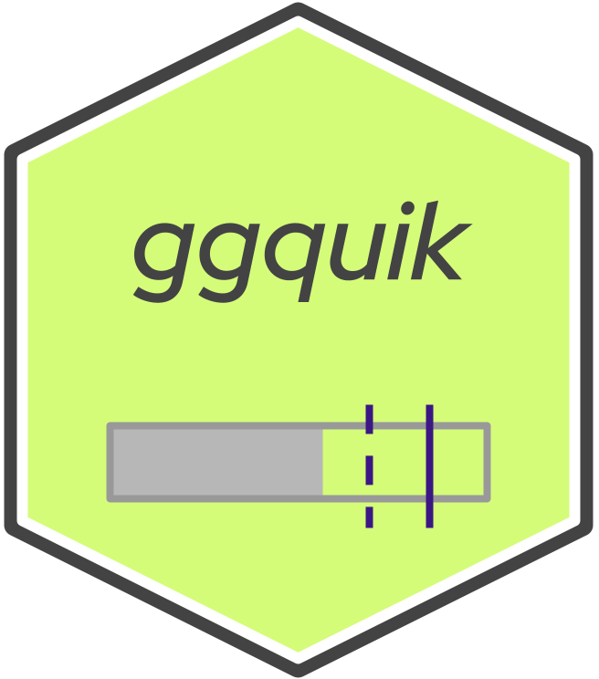

# ggquik 
### Quick Plotting ggplot2 Wrapper

Using ggplot2, create quick bar, line, and bullet plots using standardized layouts and Red Hat color schemes.

  - [Installation](#installation)
  - [Main Functions](#main-functions)
    - [quik_bars](#quik_bars)
    - [quik_lines](#quik_lines)
    - [quik_bullets](#quik_bullets)
    - [show_redhat_colors](#show_redhat_colors)
  - [Add-On Layers](#add-on-layers)
    - [add_baseline](#add_baseline)
    - [add_baseband](#add_baseband)
  - [Additional Functions](#additional-functions)
    - [show_redhat_colors](#show_redhat_colors)
  - [Customization](#customization)
    - [palette_type](#palette_type)
    

## Installation
In order to install ggquik:

``` R
# Install the development version from GitHub:
# install.packages("devtools")
devtools::install_github("brascoball/ggquik") 
```

## Main Functions

This package has three main functions: `quik_bars()`, `quik_lines()`, `quik_bullets()`, `show_redhat_colors()`:

### quik_bars
This function uses ggplot2 to quickly create a bar plot using ggquik plot standards. The function only requires a dataset, `dimension`, `measure`, and `groups`:

``` R
data(morley)
qb <- quik_bars(morley, dimension = 'Run', measure = 'Speed', groups = 'Expt')
qb
```


ggquik also has a very simple theme that is very customizable:

``` R
quik_theme(qb)
```


And, if you want to keep the axis tick labels (`axis.text`) titles (`axis.title`):

``` R
quik_theme(qb, axis.text = 'y', axis.title = c('x', 'y'))
```


### quik_lines
This function uses ggplot2 to quickly create a line plot using ggquik plot standards. The function only requires a dataset, `dimension`, `measure`, and `groups`. Using the same example, since there are a LOT of labels, we'll set the `text_size` to 0, and also use the same theme parameters as with `quik_bars()`.

``` R
data(morley)
ql <- quik_lines(morley, dimension = 'Run', measure = 'Speed', groups = 'Expt', text_size = 0)
quik_theme(ql, axis.text = 'y', axis.title = c('x', 'y'))
```


### quik_points
This function uses ggplot2 to quickly create a scatter plot using ggquik plot standards. The function only requires a dataset, `dimension`, `measure`, and `groups`. We'll use the same exact setup as `quik_lines()`:

``` R
data(morley)
qp <- quik_points(morley, dimension = 'Run', measure = 'Speed', groups = 'Expt', text_size = 0)
quik_theme(qp, axis.text = 'y', axis.title = c('x', 'y'))
```


### quik_bullets
This is a more manual plot, but is helpful for things like key performance indicators (KPIs). It requires a dataset, `group`, `range_low`, `range_high`, and measure (`bar_fill`, `dotted_line`, or `solid_line`). For example you could just use a solid line:

``` R
df <- data.frame(
  group = factor(c('Reliability', 'Accuracy', 'Uptime', 'Efficiency')),
  dotted = sample(90:100, 4), solid = sample(80:100, 4),
  fill = sample(80:100, 4), low = c(50, 75, 80, 80), high = rep(100, 4)
)
qbul <- quik_bullets(df, group_col = 'group', range_low = 'low', range_high = 'high',
                    solid_line = 'solid')
quik_theme(qbul, axis.text = 'x')
```

Or, you could use all three:

``` R
qbul <- quik_bullets(df, group_col = 'group', range_low = 'low', range_high = 'high',
                    solid_line = 'solid', dotted_line = 'dotted', bar_fill = 'fill')
quik_theme(qbul, axis.text = 'x')
```


## Add-On Layers
Just like with ggplot2, new layers can be added onto an existing ggplot made using ggquik. What's great about these layers is that they can be added _underneath_ the existing layers. The three add-on layer options are `add_baseline()`, `add_baseband()`, and `add_projection()`:

### add_baseline
This function uses ggplot2 to quickly add a horizontal or vertical baseline to a plot. It's purpose is to mark a dimension that you expect a change, or a measure that is a baseline you are measuring against (e.g. 100%). The function requires a ggplot, an direction (`'x'` or `'y'`), and the intercept. For a dimension intercept, even if it is a date, provide the ordinal number. Using the same line example above:

``` R
ql <- add_baseline(ql, 'x', 7)
quik_theme(ql, axis.text = 'y', axis.title = c('x', 'y'))
```


### add_baseband
This function uses ggplot2 to quickly add a horizontal or vertical rectangle to the background of a plot. It's purpose is to mark a band of values that meet a certain criteria. The function requires a ggplot, an direction (`'x'` or `'y'`), the `min` band value, and the `max` band value. For a dimension band, even if it is a date, provide the min and max as ordinal numbers. Using the same point example above:

``` R
qp <- add_baseband(qp, 'y', 800, 900)
quik_theme(qp, axis.text = 'y', axis.title = c('x', 'y'))
```


## Additional Functions

### show_redhat_colors
The standard colors in ggquik are the [open source colors](brand.redhat.com/elements/color/) used at Red Hat. `show_redhat_colors()` allows you to see all the color options that can be used for the `quik_bars(bar_colors)`, `quik_lines(line_colors)`, and `quik_bullets(line_colors)` parameters. The colors are displayed in a plot like this:


